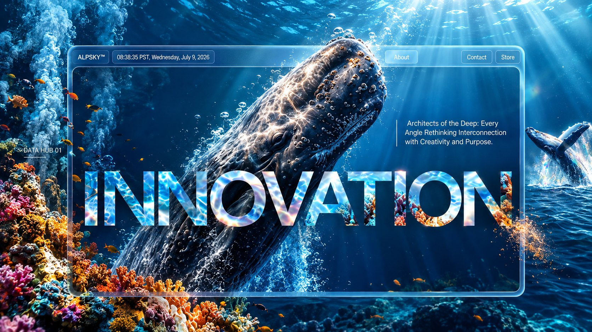

# Hemwunt Khadun · Portfolio



A developer portfolio told as a dive. You land on the surface of the sea, then scroll, and go under.

**Live:** [hemant-khadun.github.io/hemwunt](https://hemant-khadun.github.io/Hemwunt/)

## What's down there

- **The surface.** A live water simulation with sky, waves and sun glare, seen from a camera bobbing at the waterline. Tap the water and it ripples.
- **The dive.** Each scroll plays the next scene of the story. The light fades with depth the way it does underwater, with god rays, marine snow and a bubble cloud where the water breaks.
- **The whale.** A humpback swims the story with you, and partway down it passes the screen and writes the next line in its wake.
- **The work.** Five projects, each at its own depth: Marvella, FutureSpace, Konzé, Artisanal and KinderGarden.
- **On phones too.** The same effects on every device. When a device falls behind, the page lowers its render resolution before it gives up any effect.

## Built with

- React 18, TypeScript and Vite
- three.js through React Three Fiber, drei and postprocessing (ambient occlusion, bloom and a custom underwater light pass)
- GSAP ScrollTrigger and Lenis for the scroll

## Run it locally

Requires Node 22.

```bash
npm ci
npm run dev       # dev server
npm run build     # type-check and build to dist/
npm run preview   # serve the build
```

Every push to `main` builds the site and publishes it to GitHub Pages (`.github/workflows/deploy.yml`).

## Where things are

| Path | What it holds |
| --- | --- |
| `src/components/` | The page sections, the whale and the ocean scene |
| `src/animations/` | The dive: scroll, depth, light and the whale's choreography |
| `lib/` | The fluid effect behind the menu |
| `scripts/` | Tools for rebaking the whale's swim clip and for headless visual checks |

## Credits

- [Humpback Whale](https://sketchfab.com/3d-models/humpback-whale-7984cdf86d6946ca8e13f94a5ad5b33c) model by [Bohdan Lvov](https://sketchfab.com/ostapblendercg), licensed [CC BY 4.0](http://creativecommons.org/licenses/by/4.0/). Its swim animation was rebaked for this site.
- The water simulation, caustics and surface optics are adapted from WebGL Water by Evan Wallace and its [PlayCanvas port](https://github.com/willeastcott/webgpu-water-playcanvas), under the MIT license (see `src/components/ocean/LICENSE-webgl-water.txt`).
- The menu's fluid effect started from [react-fluid-distortion](https://github.com/whatisjery/react-fluid-distortion) by whatisjery, which is based on Pavel Dobryakov's [WebGL Fluid Simulation](https://github.com/PavelDoGreat/WebGL-Fluid-Simulation).
- Environment maps from [Poly Haven](https://polyhaven.com/) (CC0).
- Type: Montserrat and Instrument Serif, from Google Fonts (SIL Open Font License).
